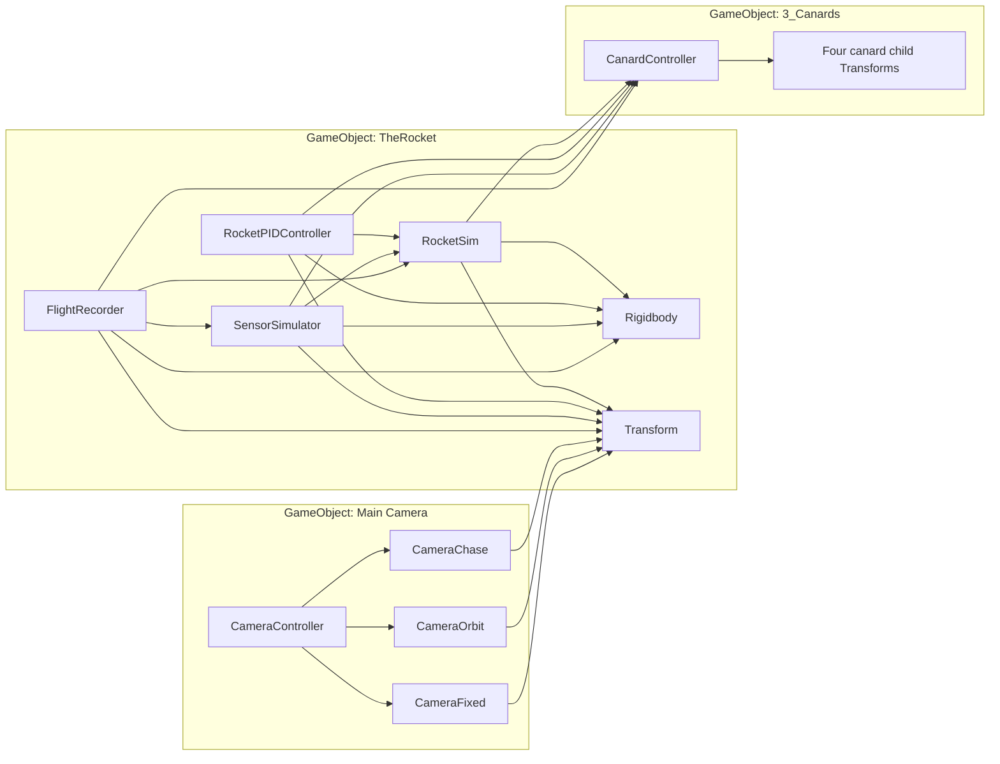

# Architecture

This describes the current structure of the codebase.

## Code map

All code is found under `Assets/Scripts` 

| Component | Responsibility |
| --- | --- |
| RocketSim.cs | Rigidbody mass updates, gravity, thrust, aerodynamic and canard forces. Essentially all aerodynamic forces |
| CanardController.cs | Canard controlling script, providing rotations for four canards |
| RocketPIDController.cs | PID controller script for the canards |
| SensorSimulator.cs | Noisy measurements and delays to simulate barometers, accelerometers, etc. |
| GaussianRandom.cs / DelayLine.cs | Noise generation and sample buffering |
| FlightRecorder.cs | Writes truth and sensor frames to JSONL |
| RocketStateFrame.cs / SensorFrame.cs | JSON-serialisable output |
| RocketPlayback.cs / CSVLoader.cs / State.cs | Old render-only code for a CSV file of rocket states |
| ParachuteDynamics.cs / FlightLogConverter.cs | Placeholders |
| CameraScripts/ | Camera viewing behaviours |

## Current execution

1. Start methods initialise the scene/rocket parameters.
2. RocketSim updates mass, applies gravity, thrust, and aerodynamic forces.
3. RocketPIDController reads rates and writes deflection commands.
4. CanardController updates the angles on each canards.
5. SensorSimulator samples the state.
6. FlightRecorder saves the true state and latest sensor output.

Due to the way in which multiple Unity scripts cross-reference each other, there may be additional back and forward steps in between. Check the ER diagram to see how everything is linked.

## Scene component diagram

The diagram below shows how different components are linked together with Unity GameObjects. Other components used for logging or utility act independently at the end of each game tick or physics tick. "Transform" and "Rigidbody" are just the standard Unity scripts that handle coordinates and 3D physics.



## Future structure

Physical calculations, sensor states, actuator states, and control logic should be kept independent to rendering.

The flat Scripts directory is fine at this size, but a better layout could be used if more scripts are introduced:

```text
Assets/
  Scripts/
    Simulation/     RocketSim, ParachuteDynamics
    Control/        RocketPIDController, CanardController
    Sensors/        SensorSimulator, SensorFrame, DelayLine, GaussianRandom
    Recording/      FlightRecorder, RocketStateFrame, FlightLogConverter
    Playback/       RocketPlayback, CSVLoader, State
    Cameras/        existing CameraScripts contents
    Configuration/ ThrustCurveAssets
    Debugging/      Test
  Editor/           ThrustCurveEditor
  Data/             thrust-curve assets and source data, when reorganised
```

## OpenRocket 

The structure was designed to be entirely OpenRocket compatible, allowing one to export a design/3D model directly from OR to Unity. Importing geometry does not by itself import individual parameters like mass, fuel, aerodynamic coefficients, or any dimensions.

More comparisons against OpenRocket should be carried out in the future to test the validity of the code.