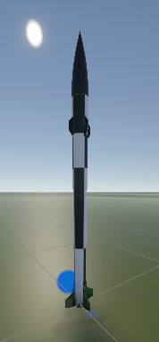

# Model assumptions, structure, and limitations

The current model is quite simple and canard actuation relies on a highly simplified aerodynamic model.

## Coordinates and units

- SI units for length (m), mass (kg), time (s), force (N), pressure (Pa), and inertia (kg m^2).
- Unity world +Y is up; the rocket's local +Y is its longitudinal axis.
- Unity uses a left-handed coordinate convention. Explicitly document any conversion to external simulation frames.
- CG and CP are positioned axially from the nose. Positions are obtained from OpenRocket.
- Orientation arrays use Unity quaternion order **[x, y, z, w]**.
- Rigidbody angular velocity and angle of attack are in radians per second and radians.
- Canard commands and logged canard angles are in degrees.
- Logged position and linear/angular velocity are world-frame values; IMU readings are body-frame values.
- Altitude currently means transform.position.y, not a general geographic altitude model. Launches are assumed from sea-level.

Check any saved values before running any tests.

## Active model

RocketSim uses a Unity Rigidbody. Gravity is applied explicitly, so the simulated rocket must not also use built-in Rigidbody gravity. Aerodynamics use basic exponential air density, fixed aerodynamic coefficients (soon to be interpolated), and an approximate angle-dependent force applied at a fixed CP.

The thrust profile is imported directly as a CSV of impulse over time. Propellant consumption is calculated from thrust, specific impulse, gravity, and the fixed timestep. CG is interpolated with remaining fuel.

Canard forces use a simplified model. There are no dynamic coefficients, actuator dynamics, or simulated airflow. The forces applied rely on the assumptions of small deviations, negligible mass, and fixed CP.

These findings are a starting backlog, not a completed physics audit.

## Output interpretation

FlightLogs contains paired truth and sensor JSONL files. This directly matches A-StaR's flight computer flight log data.

| Field | Meaning |
| --- | --- |
| timestamp | Sensor simulator's accumulated time, rounded to milliseconds |
| state | Flight-phase classifier: 0 pad, 1 powered ascent, 2 coast, 3 descent, 4 landed |
| raw_accel | Body-frame specific force, m/s^2, with noise and bias |
| raw_gyro | Body-frame angular rate, rad/s, with noise and drift |
| pressure | Simulated noisy barometer reading, Pa |
| altitude (sensor file) | Estimate derived from pressure |
| quats (both files) | Perfect orientation, not an estimated attitude |
| servo | Simulated canard angles, not independent measured servo feedback |
| gyro_bias | Internal simulated bias state, not a measured sensor channel |

True vs. sensor data is not yet implemented for PID controls.